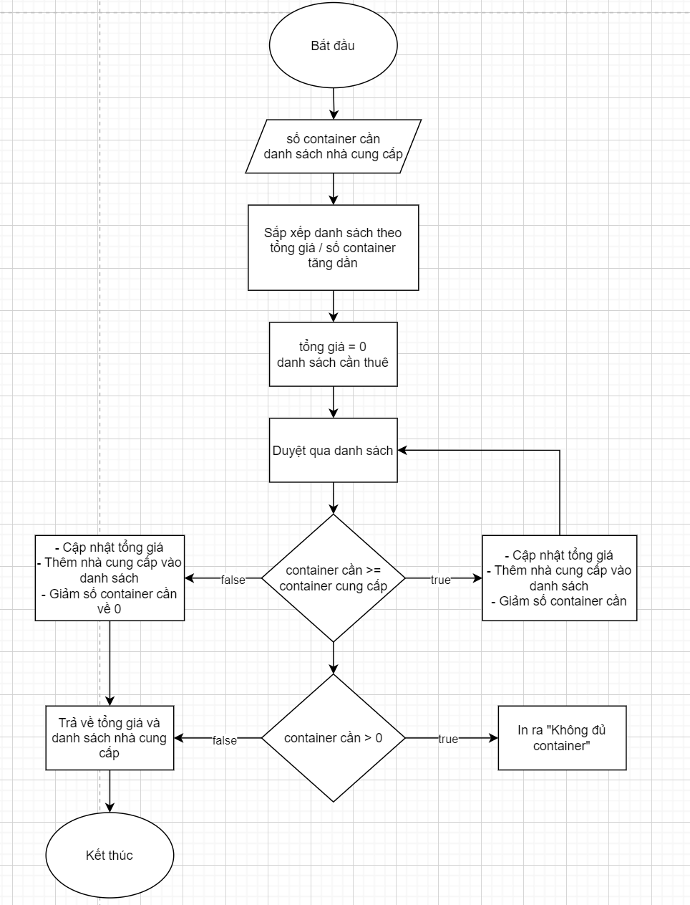

### Câu 1:

### Câu 2:

- Admin - Agency: manages (1-Nhiều)
  - Một admin có thể quản lý nhiều agency như thêm, sửa, xoá.
- Agency - Product: sells (1-Nhiều)
  - Một agency có thể sở hữu và bán nhiều sản phẩm khác nhau.
- Agency - Transaction: participates in (1-Nhiều)
  - Một agency có thể tham gia nhiều giao dịch khác nhau.
- Transaction - Billing: linked to (1-1)
  - Mỗi giao dịch sẽ liên kết với 1 biên lai duy nhất về thông tin giao dịch đó.
- Customer - Transaction: makes (1-Nhiều)
  - Cũng giống như agency, một khách hàng cũng có thể thực hiện nhiều giao dịch.
- Customer - Cart: owns (1-1)
  - Mỗi khách hàng sẽ có 1 giỏ hàng duy nhất.
- Cart - Cart_Item: contains (1-Nhiều)
  - Mỗi giỏ hàng có thể chứa nhiều Cart-Item (đại diện cho từng sản phẩm).
- Cart_Item - Product: linked to (1-1)
  - Mỗi Cart_Item chỉ liên quan đến một Product cụ thể.
