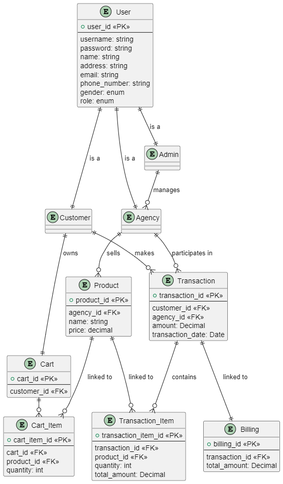

### Câu 1: Flowchart

### Câu 2: ERD

- User - Admin, Customer, Agency: is a (1-1)

  - User là bảng cha với thông tin chung như username, password, thông tin cá nhân và role.
  - Admin, Agency, Customer sẽ phân biệt thông qua role.

- Admin - Agency: manages (1-Nhiều)

  - Một admin có thể quản lý nhiều agency như thêm, sửa, xoá.

- Agency - Product: sells (1-Nhiều)

  - Một agency có thể sở hữu và bán nhiều sản phẩm khác nhau.

- Agency - Transaction: participates in (1-Nhiều)

  - Một agency có thể tham gia nhiều giao dịch khác nhau.

- Customer - Transaction: makes (1-Nhiều)

  - Cũng giống như agency, một khách hàng cũng có thể thực hiện nhiều giao dịch.

- Customer - Cart: owns (1-1)

  - Mỗi khách hàng sẽ có 1 giỏ hàng duy nhất.

- Cart - Cart_Item: contains (1-Nhiều)

  - Mỗi giỏ hàng có thể chứa nhiều Cart-Item (đại diện cho từng sản phẩm).

- Product - Cart_Item: linked to (1-Nhiều)

  - Mỗi sản phẩm có thể được thêm vào nhiều giỏ hàng khác nhau.

- Product - Transaction_Item: linked to (1-Nhiều)

  - Một sản phẩm có thể xuất hiện trong nhiều giao dịch khác nhau.

- Transaction - Billing: linked to (1-1)

  - Mỗi giao dịch sẽ liên kết với 1 biên lai duy nhất về thông tin giao dịch đó.

- Transaction - Transaction_Item: contains (1-Nhiều)
  - Một giao dịch có thể chứa nhiều mục giao dịch, tương ứng với từng sản phẩm trong giao dịch.

\*\*\*Note:

- customer_id trong Cart và Transaction phải tham chiếu đến User với role = "Customer".
- agency_id trong Product và Transaction phải tham chiếu đến User với role = "Agency".

### Câu 3:

- Với ERD đã thiết kế ở trên, cơ sở dữ liệu em dùng để triển khai là MongoDB.
- Lý do và cũng là ưu điểm của MongoDB:
  - MongoDB là một hệ quản trị cơ sở dữ liệu NoSQL
  - Dễ cài đặt và sử dụng
  - Không cần Schema cố định, có thể thêm các trường mới vào cơ sở dữ liệu mà không phải sửa đổi cấu trúc toàn bộ cơ sở dữ liệu.
  - Cộng đồng lớn và công cụ tích hợp tốt với các framework phổ biến hiện nay.
- Nhược điểm:
  - Truy vấn ít linh hoạt khi cần thực hiện các truy vấn phức tạp.
  - Không tuân thủ ACID mạnh mẽ như các hệ quản trị cơ sở dữ liệu quan hệ
